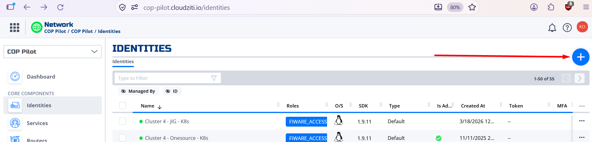
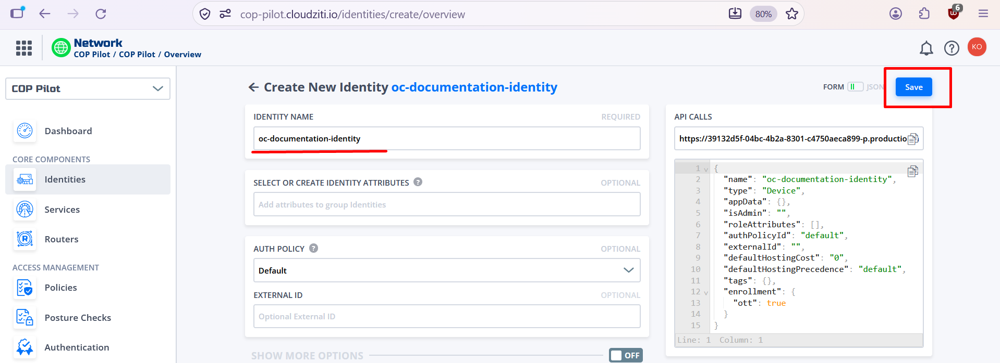
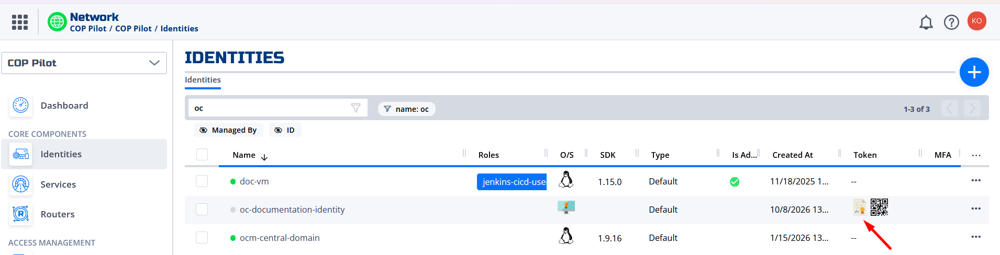
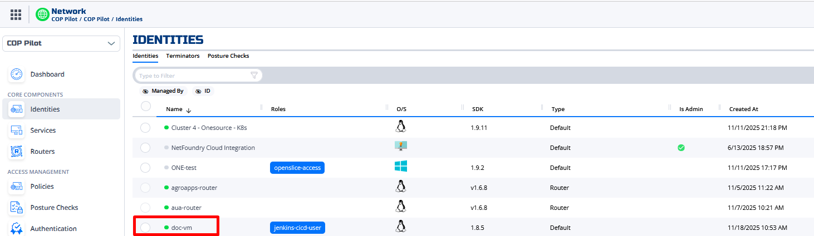
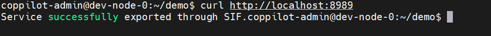
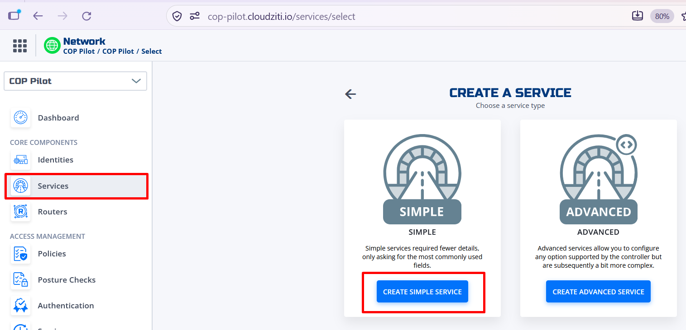
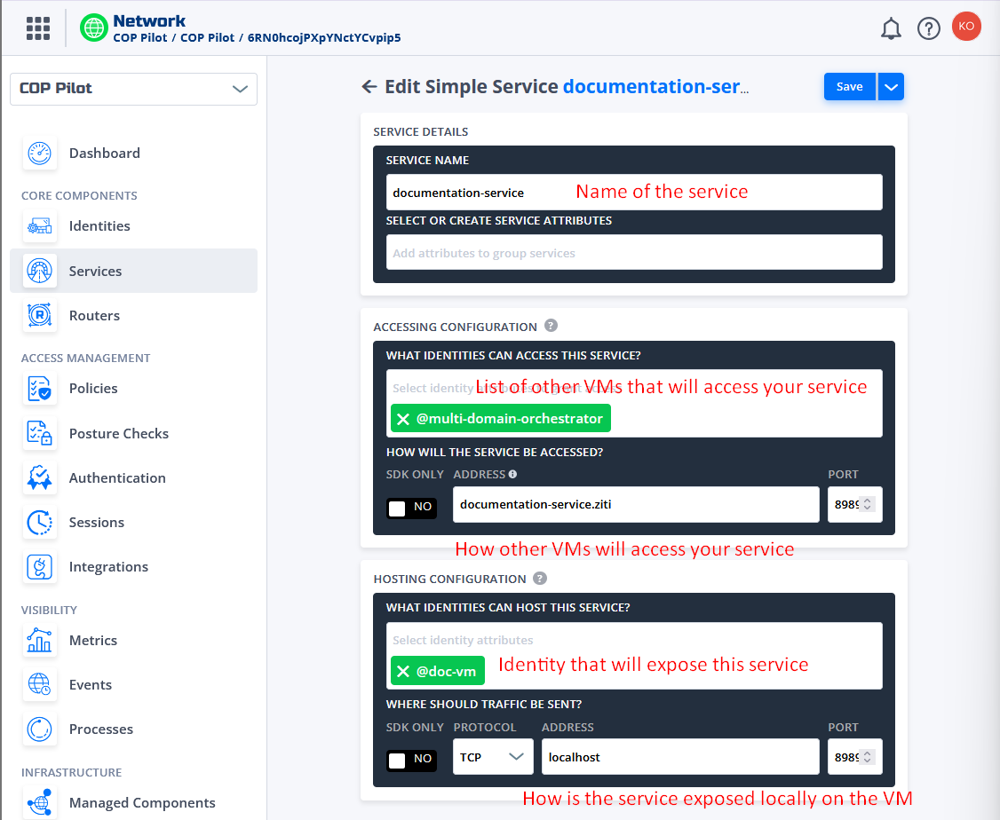
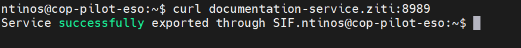

# 🟣 SIF Layer

## 🔐 Join the CloudZiti Network

NetFoundry hosts the CloudZiti environment used by the COP-PILOT project:

🌐 [Open the COP-PILOT CloudZiti console](https://cop-pilot.cloudziti.io/)

To request access:

1. Contact the NETC team at [konstantinos.fragkos@netcompany.com](mailto:konstantinos.fragkos@netcompany.com) and [panagiotis.matzakos@netcompany.com](mailto:panagiotis.matzakos@netcompany.com).
2. The NETC team will coordinate your invitation with NetFoundry.
3. Accept the invitation to join the CloudZiti network.

## 🖥️ Connect a VM or Server

Each VM or server that connects to CloudZiti needs its own identity.

### 1. Create an identity

1. Sign in to the [CloudZiti console](https://cop-pilot.cloudziti.io/).
2. Create a new identity.
3. Choose a clear, unique name that identifies the VM and its purpose. For an OpenSlice instance, use `openslice-<opencall>-<company>` (for example, `openslice-oc1-upv`). For other hosts, use a descriptive name such as `oc-jdoe-contextbroker`.
4. Download the identity's JWT enrollment token.

Enter the identity name and, if requested by the console, an email address that helps identify the identity's owner or purpose.

Download the JWT enrollment token for the new identity

### 2. Enroll the VM

Follow the [identity enrollment script guide](https://github.com/cop-pilot-eu/platform-integration-pipelines/tree/main/sif-layer-pipelines/identity-script). It explains how to copy the JWT token and enrollment script to the VM and install the Ziti tunneler as a `systemd` service.

Once enrollment is complete, the tunneler runs in the background and starts automatically after a reboot. Allow a few minutes for the identity to appear online in the CloudZiti console.

## 🔗 Expose a Service Through CloudZiti

After the VM is connected, you can make a service on it available to other authorized CloudZiti identities. For example, assume a web service is running on port `8989`.

### 1. Confirm the service is running locally

Check that the service responds on the VM before configuring CloudZiti.

### 2. Create the service in CloudZiti

In the CloudZiti console, create a service for the application and configure its address and port. Associate the service with the identity that hosts it, and configure access for the identities that need to connect.

### 3. Verify access from another VM

From another VM enrolled in CloudZiti and authorized to use the service, test the service using its CloudZiti service name or configured address.

The service should now be reachable through CloudZiti by authorized identities.
